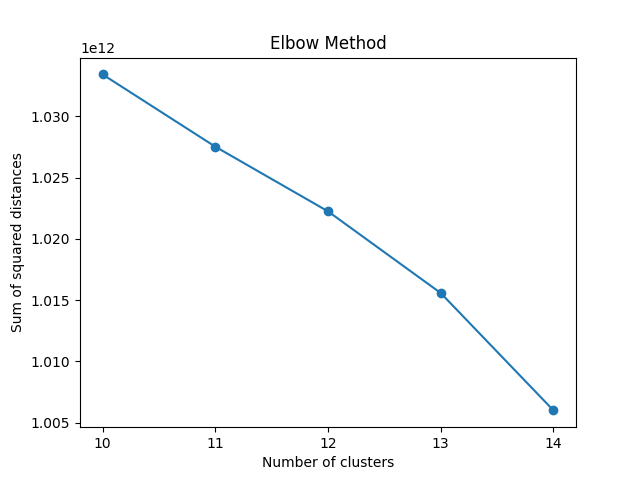
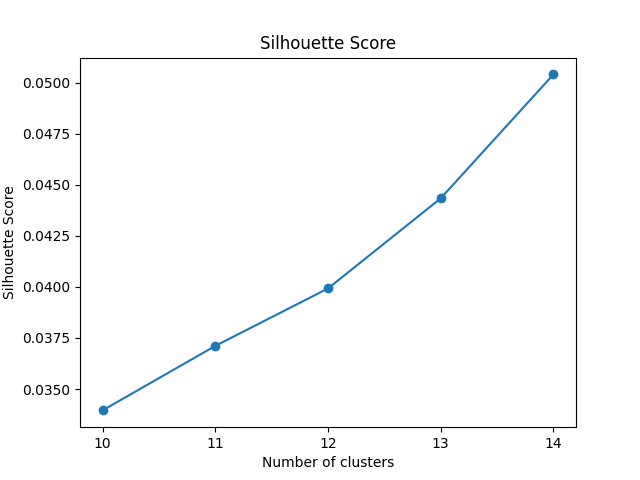
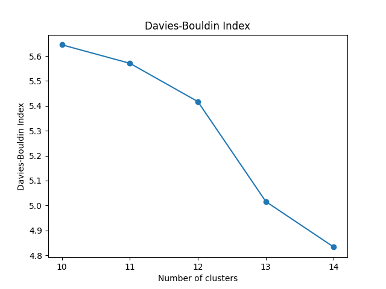
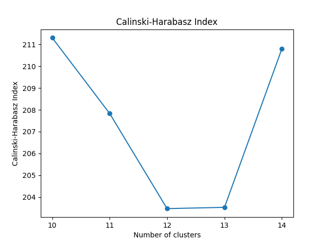

## TODO
1. Each element should be split into separate parts inside the code, allowing it to run for different data.

### Data loader
1. The data loader is almost ready. Add some type of report after each data loading to save measurements and display them later.

### K-means clustering
1. Time consumption measuring. 
2. Save clustering data into a file. DONE saved into json type file for each clustering. 
3. Implement scores to measure if clustering was done correctly. To speed up this process, check if it is possible to use a subset of the map (e.g., 1/4 or 1/8) for clustering. 
4. Improve the plot to make elements clearer.

### Normalized cross-correlation on each cluster
1. Determine if this should be sourced from the kikuchipy library or implemented manually.
2. Consider writing the implementation yourself.

### Average picture inside one cluster
### Avreage picture inside one cluster 

# Clustering Evaluation Metrics

This document provides an overview of the clustering evaluation metrics used to assess the quality of clustering results. The metrics include the Elbow Method, Silhouette Score, Davies-Bouldin Index, and Calinski-Harabasz Index.

## Elbow Method

The Elbow Method is used to determine the optimal number of clusters by plotting the sum of squared distances (inertia) from each point to its assigned cluster center. The "elbow" point, where the rate of decrease sharply changes, indicates the optimal number of clusters.

## Silhouette Score

The Silhouette Score measures how similar each point is to its own cluster compared to other clusters. The score ranges from -1 to 1, where a higher score indicates better-defined clusters.

## Davies-Bouldin Index

The Davies-Bouldin Index measures the average similarity ratio of each cluster with the cluster that is most similar to it. A lower Davies-Bouldin Index indicates better clustering.

## Calinski-Harabasz Index

The Calinski-Harabasz Index measures the ratio of the sum of between-cluster dispersion and within-cluster dispersion. A higher Calinski-Harabasz Index indicates better-defined clusters.

## Summary

- **Elbow Method**: Helps determine the optimal number of clusters.
- **Silhouette Score**: Measures the quality of clustering.
- **Davies-Bouldin Index**: Evaluates the average similarity ratio of clusters.
- **Calinski-Harabasz Index**: Assesses the ratio of between-cluster and within-cluster dispersion.

These metrics provide a comprehensive evaluation of the clustering results, helping to ensure that the chosen number of clusters is appropriate and that the clusters are well-defined.

For n_clusters = 461:
Average Silhouette Score: 0.5847690249058602
Calinski-Harabasz Index: 275.656287579842
Davies-Bouldin Index: 1.4980484615048413
Inertia: 201803171036.3817

I want to you to write me code to performe this actions on my dataset (for each element i will give you code if i already written something, i will give you my code only if it works for me):
    1. Load data from h5oina file, performe clustering and show Calinski-Harabasz Index, Davies-Bouldin Index, Inertia and also save data after clustering to json file with this scores and as many usefull data wich can be source form kmenas class. Also add shoiloutet socre. Show map of clusters
    "import h5py
import numpy as np
from sklearn.cluster import KMeans
from sklearn.metrics import silhouette_score, calinski_harabasz_score, davies_bouldin_score, adjusted_rand_score
import matplotlib.pyplot as plt
import matplotlib.colors as mcolors

# Ścieżka do pliku HDF5
file_path = 'input_data/large Specimen 1 averaging test 25 frames.h5oina'

# Wczytanie danych z pliku h5
with h5py.File(file_path, 'r') as file:
    processed_patterns_dataset = file['/1/EBSD/Data/Processed Patterns']
    ebsd_data = np.array(processed_patterns_dataset)
    X_coords = file['/1/EBSD/Data/X'][:]
    Y_coords = file['/1/EBSD/Data/Y'][:]

# Przekształcenie danych do postaci jednej dużej macierzy
n_frames, width, height = ebsd_data.shape
X = ebsd_data.reshape((n_frames, width * height))

# Klastrowanie
n_clusters = 461
kmeans = KMeans(n_clusters=n_clusters, random_state=0)
kmeans.fit(X)

# Etykiety klastrów
labels = kmeans.labels_

# Calculate evaluation metrics
silhouette_avg = silhouette_score(X, labels)
calinski_harabasz_avg = calinski_harabasz_score(X, labels)
davies_bouldin_avg = davies_bouldin_score(X, labels)
inertia = kmeans.inertia_ "
    2. Dla obrazów w ramach jednego komponenetu (klasta) oblicz ich podobieństwo jako Normalised Cross Correlation, i dla każdego z komponentów podaj średni wynik np.
    3. After this take all elements of each cluster compute mean value and overwrite all elements whit mean value of choosen componennt 